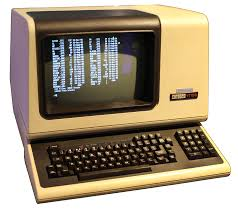

# Shell vs Terminal

## The Shell

* The Shell is the command line interpreter, meaning that it takes the commads that you enter & sends them to the OS to execute, asssociated functions.

* And so to make things clear, the **Shell** is what actually handles the commands, it is default interface to the linux.

* It is of several types -
	* Bourne shell ( sh )
	* Korn shell ( ksh )
	* Bourne Again shell ( bash )
	* POSIX shell ( sh)

## The Terminal

* On the other hand, The **Terminal** is just a graphical interface to the shell. In other words, we access the shell through our **terminal** in a GUI (Graphical User Interface) environment.

* Historically, The Terminal was a physical device that connects to a computer, usually over serial cable or modem. Like the picture below -
<!-- [! physical terminal](terminal.jpeg "Physical Terminal") -->

* But nowadays, when someone says a Terminal, he really means a Terminal emulator. The word emulator here means imitate. That's to say that it's a software (Program) that imitates the physical device that was once called a Terminal.

* People use the two terms (**Terminal** & **Terminal Emulator**) interchangeably, so don't get confused. They mean the same thing nowadays.

